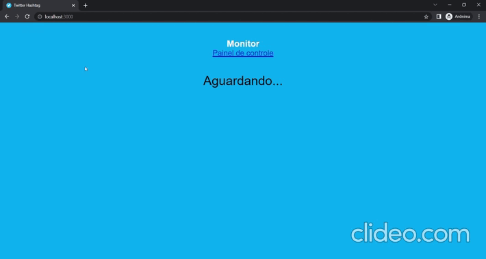

## Get na API do Twitter de acordo com a Hashtag informada no Front-end - Servidor [Back-end]

Servidor da aplicação de monitoramento de hashtag no Twitter.



## Começando

### Pré-requisitos

Para executar este projeto no modo de desenvolvimento, você precisará ter um ambiente básico com o NodeJS 8+ instalado. Para saber mais, clique [aqui](https://nodejs.org/en/).

Além disso, você precisará ter o [Redis](https://redis.io/) instalado e em execução na sua máquina..

### Instalando

**Clonando o Repositório**

```
$ git clone https://github.com/alexjou/get_tweets

$ cd get_tweets
```

**Instalando dependências**

```
$ yarn
```


### Configurando Conexão com a API do Twitter

1 - Acesse o site [Twitter Developer](https://developer.twitter.com/en) e registre uma conta de desenvolvedor, crie uma aplicação e obtenha seu _Bearer Token_.

2 - Após o passo 1, acesse o arquivo [src / configs / SecretApiTwitter.js](https://github.com/alexjou/get_tweets/blob/master/src/configs/SecretApiTwitter.js) e edite o valor do campo `bearer\_token` (linha 3) informando o seu _Bearer Token_.

3 - Acesse o arquivo [src / configs / Api.js](https://github.com/alexjou/get_tweets/blob/master/src/configs/Api.js) e edite o valor do campo baseURL (linha 2) informando o seu o IP da sua máquina, exemplo _http://localhost:3333_.

4 - Acesse o arquivo [src / configs / Redis.js](https://github.com/alexjou/get_tweets/blob/master/src/configs/Redis.js) e edite os valores dos campos `host` (linha 2), `port` (linha 3) e `password` (linha 4) informando os dados de conexão do seu Redis.

### Rodando o servidor

Com todas as dependências instaladas e o ambiente configurado corretamente, agora você pode executar o servidor:

```
$ yarn dev
```

## Rotas (Endpoints)

O URL base é: http://localhost:3333/api

### Monitorar Tweets

- Iniciar/Parar monitoramento de determinada Hashtag

| URL      | Method | Params                                                                               | URL Params | Success Response                                                     | Error Response                                                                                                              |
| -------- | ------ | ------------------------------------------------------------------------------------ | ---------- | -------------------------------------------------------------------- | --------------------------------------------------------------------------------------------------------------------------- |
| /monitor | `POST` | `hashtag` - String com a hashtag <br /><br /> `monitoring` - Status do monitoramento | -          | **Code:** 200 - OK<br />**Content:** `{ success: true, errors: [] }` | **Code:** 500 - INTERNAL SERVER ERROR <br />**Content:** `{ success: false, errors: [<Mensagem com a descrição do Erro>] }` |

- Resetar listas e campos

| URL            | Method | Params | URL Params | Success Response                                                     | Error Response                                                                                                              |
| -------------- | ------ | ------ | ---------- | -------------------------------------------------------------------- | --------------------------------------------------------------------------------------------------------------------------- |
| /monitor/reset | `POST` | -      | -          | **Code:** 200 - OK<br />**Content:** `{ success: true, errors: [] }` | **Code:** 500 - INTERNAL SERVER ERROR <br />**Content:** `{ success: false, errors: [<Mensagem com a descrição do Erro>] }` |

- Aprovar Tweet

| URL                     | Method | Params             | URL Params | Success Response                                                     | Error Response                                                                                                              |
| ----------------------- | ------ | ------------------ | ---------- | -------------------------------------------------------------------- | --------------------------------------------------------------------------------------------------------------------------- |
| /monitor/tweets/approve | `POST` | `id` - ID do Tweet | -          | **Code:** 200 - OK<br />**Content:** `{ success: true, errors: [] }` | **Code:** 500 - INTERNAL SERVER ERROR <br />**Content:** `{ success: false, errors: [<Mensagem com a descrição do Erro>] }` |

- Rejeitar Tweet

| URL                    | Method | Params             | URL Params | Success Response                                                     | Error Response                                                                                                              |
| ---------------------- | ------ | ------------------ | ---------- | -------------------------------------------------------------------- | --------------------------------------------------------------------------------------------------------------------------- |
| /monitor/tweets/reject | `POST` | `id` - ID do Tweet | -          | **Code:** 200 - OK<br />**Content:** `{ success: true, errors: [] }` | **Code:** 500 - INTERNAL SERVER ERROR <br />**Content:** `{ success: false, errors: [<Mensagem com a descrição do Erro>] }` |

- Receber Tweets

| URL                     | Method | Params                     | URL Params | Success Response                                                     | Error Response                                                                                                              |
| ----------------------- | ------ | -------------------------- | ---------- | -------------------------------------------------------------------- | --------------------------------------------------------------------------------------------------------------------------- |
| /monitor/tweets/receive | `POST` | `tweets` - Lista de Tweets | -          | **Code:** 200 - OK<br />**Content:** `{ success: true, errors: [] }` | **Code:** 500 - INTERNAL SERVER ERROR <br />**Content:** `{ success: false, errors: [<Mensagem com a descrição do Erro>] }` |
